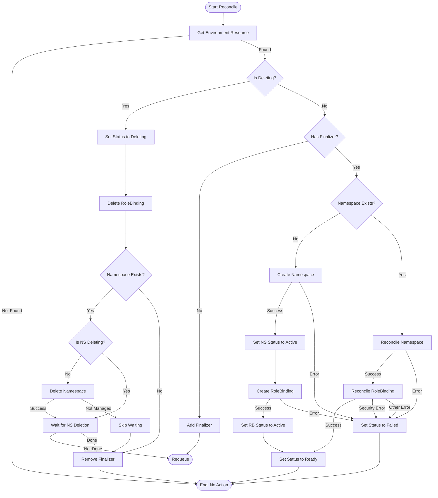

**Controller Responsibilities & Security Outline:**

1.  **Core Function: Environment Resource Reconciliation**
    *   **Watch:** Monitor `Environment` custom resources (CRs).
    *   **React:** Trigger reconciliation logic upon creation, update, or deletion detection (`metadata.deletionTimestamp`).
    *   **Idempotency:** Ensure all reconciliation operations are strongly idempotent, with careful state checks before applying changes.

2.  **Namespace Management**
    *   **On `Environment` Creation:**
        *   **Create Namespace:** Generate a namespace name using the environment's ID with configurable suffix (e.g., `<environment-id><suffix>`).
        *   **Set Ownership:** Use label-based ownership tracking (`quix.io/managed-by`, `quix.io/environment-id`, `quix.io/environment-name`).
        *   **Custom Metadata:** Apply custom labels and annotations from the Environment spec, with validation that they use the `quix.io/` prefix.
        *   **Protected Metadata:** Prevent overriding of protected labels and annotations, enforced through validations.
        *   **Idempotency:** If the namespace already exists and is correctly owned, reconcile metadata. If it exists but is *not* owned correctly, error with appropriate message.
    *   **On `Environment` Deletion:**
        *   **Add Finalizer:** Ensure the `Environment` CR has a finalizer (`quix.io/environment-finalizer`) before proceeding with namespace creation.
        *   **Delete Namespace:** When `metadata.deletionTimestamp` is set on the `Environment` CR, initiate the deletion of the corresponding managed `Namespace`.
        *   **Wait for Deletion:** Monitor the managed `Namespace`. Only remove the finalizer from the `Environment` CR *after* the `Namespace` is confirmed deleted.
    *   **On `Environment` Update:**
        *   **Metadata Updates:** Apply and update any changes to labels or annotations from the Environment spec to the managed namespace.
        *   **Validation:** Ensure all custom labels/annotations use the required `quix.io/` prefix and don't override protected keys.
        *   **Handle Conflicts:** Implement proper error handling for update conflicts with appropriate retry logic.

3.  **RBAC Management (Namespace-Scoped Binding)**
    *   **Service Account Distinction:**
        *   **Controller Service Account:** This service account is used by the operator itself and requires cluster-level permissions to manage Environment CRs, Namespaces, and RoleBindings.
        *   **Quix Platform Service Account:** This is a separate service account that end-users interact with. It is bound only at the namespace level and has strictly limited permissions.
    *   **On `Environment` Creation (Post-Namespace):**
        *   **Define Target `ClusterRole` (External):** Use a pre-existing `ClusterRole` defined cluster-wide (configured via `CLUSTER_ROLE_NAME` environment variable, defaults to `quix-platform-account-role`). This `ClusterRole` must grant necessary permissions but *only* for resources typically managed *within* a namespace.
            *   **Security Validation:** Perform security validation of ClusterRole to prevent privilege escalation.
            *   **CRITICAL: ClusterRole MUST AVOID (Strict Privilege Escalation Prevention):** The target `ClusterRole` must NOT grant permissions for cluster-scoped resources or RBAC management.
        *   **Define `RoleBinding`:**
            *   **Name:** Generate name using the pattern `<environment-id>-quix-crb`.
            *   **Subject:** Bind the `ClusterRole` to the Quix Platform `ServiceAccount` configured via environment variables (`SERVICE_ACCOUNT_NAME` and `SERVICE_ACCOUNT_NAMESPACE`).
            *   **RoleRef:** Reference the configured `ClusterRole` (Kind: `ClusterRole`, Name: from config).
        *   **Create `RoleBinding`:** Create the `RoleBinding` inside the managed namespace. This binding confines the `ClusterRole`'s permissions to this namespace only.
        *   **Labeling:** Apply standard labels including `quix.io/environment-id`, `quix.io/managed-by`, and `quix.io/environment-name`.
        *   **Idempotency:** Ensure `RoleBinding` creation/update logic is idempotent.
    *   **On `Environment` Update:**
        *   **Reconcile RBAC:** Ensure the `RoleBinding` exists in the managed namespace and correctly points to the intended `ClusterRole` and `ServiceAccount` subject.
        *   **Handle Configuration Changes:** If the ClusterRole or ServiceAccount configuration changes, update the RoleBinding accordingly, potentially by recreating it when necessary.

4.  **Controller's Own Permissions (Security Boundary)**
    *   **Controller Service Account Permissions:**
        *   **ClusterRole:** The controller's `ServiceAccount` requires a `ClusterRole` with the *absolute minimum* permissions needed:
            *   `quix.io/environments`: `get`, `list`, `watch`, `update`, `patch` (including `finalizers` and `status` subresources).
            *   `core/v1/namespaces`: `get`, `list`, `watch`, `create`, `delete`, `patch`, `update`.
            *   `rbac.authorization.k8s.io/rolebindings`: `get`, `list`, `watch`, `create`, `delete`, `patch`, `update` (needed to manage bindings *within* target namespaces).
            *   `core/v1/events`: `create`, `patch` (for reporting).
            *   Permissions for resources that will be granted to the Quix platform service account (a K8s limitation - you can only bind permissions you already have).
        *   **AVOID:** The controller's `ClusterRole` must *not* include permissions for `ClusterRoles`, `ClusterRoleBindings`, modifying arbitrary resources, `pod/exec`, etc.
    *   **Kubernetes Security Model:**
        *   **Permission Inheritance Requirement:** Due to Kubernetes RBAC design, the controller must possess all permissions it grants to others. The controller's ClusterRole must include all permissions that will be granted to the Quix platform service account.
        *   **Additional Security Layer:** We implement a dedicated validation system that checks ClusterRoles for potentially dangerous permissions before binding them.
        *   **Security Verification:** Before creating any RoleBinding, the operator validates that the target ClusterRole doesn't include permissions for creating or modifying role bindings, which would allow privilege escalation.
        *   **Failure Handling:** If security validation fails, the Environment reconciliation immediately transitions to a Failed state with a clear security violation message, preventing the creation of potentially insecure resources.

5.  **Status Reporting & Events**
    *   **Detailed Status Tracking:**
        *   **Overall Environment Phase:** Track the overall state (`InProgress`, `Ready`, `Failed`, `Deleting`) in the Environment CR's `.status.phase`.
        *   **Resource-Specific Phases:** Track individual states for managed resources (`.status.namespaceStatus`, `.status.roleBindingStatus`) as ResourceStatus objects with phase and message fields.
        *   **ObservedGeneration:** Track the most recently observed generation for proper reconciliation.
        *   **LastUpdated:** Track when status was last updated.
        *   **Message:** Include human-readable messages explaining the current status.
    *   **Events:** Create Kubernetes `Events` associated with the `Environment` CR for significant actions (creation, deletion, errors).
    *   **Error Handling:**
        *   **Validation Failures:** Record validation errors in status and events.
        *   **Resource Conflicts:** Implement retry logic for conflicts with appropriate backoff.
        *   **NotFound Handling:** Handle special cases for resources not found or being deleted.
        *   **Clear Error Messaging:** Provide descriptive error messages in status and events.

6.  **Configuration Options**
    *   **Namespace Suffix:** Configurable suffix for generated namespace names.
    *   **Environment Regex:** Configurable regex pattern that environment IDs must match.
    *   **ServiceAccount:** Configurable name and namespace for the ServiceAccount to bind.
    *   **ClusterRole:** Configurable name for the target ClusterRole to bind.
    *   **ReconcileInterval:** Configurable duration between reconciliation attempts.
    *   **MaxConcurrentReconciles:** Configurable maximum number of concurrent reconciliations.

7.  **Reconciliation Flow**

