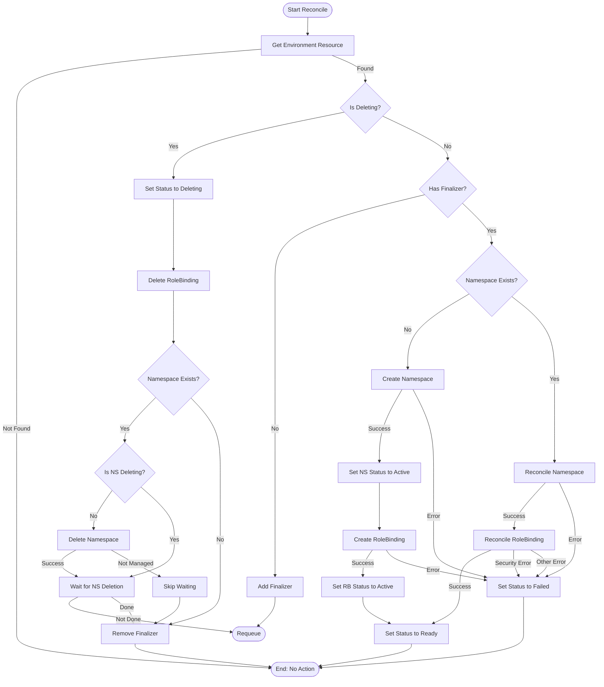

**Quix Environment Operator: Controller Architecture**

## Overview

The Quix Environment Operator manages Kubernetes resources through a controller that reconciles `Environment` custom resources. This document outlines the controller's design principles, responsibilities, and security model.

## Core Components

### 1. Environment Resource Controller

- **Reconciliation Loop**: Watches for changes to `Environment` custom resources and triggers appropriate reconciliation logic
- **State Management**: Maintains idempotent operations with proper lifecycle handling (creation, updates, deletion)
- **Resource Ownership**: Manages resources with clear ownership tracking via labels

### 2. Resource Management

#### Namespace Orchestration
- Creates and manages dedicated namespaces for each environment
- Applies consistent naming pattern with configurable suffix. The `Environment` `spec.id` must be 3-44 characters, lowercase alphanumeric (`a-z`, `0-9`) with optional internal hyphens, and must start and end with an alphanumeric character (regex `^[a-z0-9]([a-z0-9\-]*[a-z0-9])?$`); the namespace name is the `id` combined with the configured suffix
- Handles metadata propagation from Environment specs
- Manages deletion with finalizers to ensure proper cleanup

#### RBAC Configuration
- Creates namespace-scoped `RoleBindings` linking platform service account to predefined `ClusterRole`
- Separates controller permissions from platform permissions
- Ensures bindings are created with proper security validations

##### RoleBinding subject reconciliation contract
The operator reconciles each managed `RoleBinding` to guarantee the configured platform `ServiceAccount` is bound. Reconciliation is stateless with respect to subjects: additional, manually-added (out-of-band) `User`/`Group`/`ServiceAccount` subjects are tolerated **only while the expected ServiceAccount is already present** in the subject list. If the expected ServiceAccount is absent — for example because the configured ServiceAccount name or namespace changed — the entire subject list is reset to just the expected ServiceAccount, and any out-of-band subjects are removed. A warning is logged listing the removed subjects when this reset occurs.

## Security Architecture

### Permission Boundaries
- **Controller Service Account**: Limited to the cluster-level permissions the controller itself uses (managing `environments`, `namespaces`, `rolebindings`, and reading `clusterroles`), plus the `bind` verb on the configured platform `ClusterRole`.
- **Platform Service Account**: Restricted to namespace-level operations through RoleBindings, **except** for cluster-wide read/write on the cluster-scoped `Environment` CRD (see below).
- **Validation System**: Prevents privilege escalation by validating ClusterRole permissions. The operator binds only a ClusterRole, so validation targets ClusterRoles (`ValidateClusterRole`); validating arbitrary namespace-scoped `Role` resources is intentionally out of scope because the controller neither creates nor watches Roles.

#### Platform access to the cluster-scoped Environment CRD
The `Environment` CRD is **cluster-scoped** (`+kubebuilder:resource:scope=Cluster`). A namespaced RoleBinding cannot grant access to a cluster-scoped resource, so the platform ServiceAccount is granted access to `environments` via a **ClusterRoleBinding** (`platform-cluster-env-role-binding.yaml`) to a dedicated `<clusterRoleName>-env` ClusterRole (`platform-cluster-env-role.yaml`) that covers only `quix.io/environments`. This is a deliberate, documented exception to the namespace-isolation model: the "namespace-scoped isolation" guarantee applies to the **workload resources** in the provisioned namespaces (granted per-namespace by binding the broad platform ClusterRole), not to the cluster-scoped Environment objects themselves, which by their nature live at cluster scope. The grant is the sole mechanism by which the platform consumer can create and manage Environment objects, so it is retained rather than removed.

#### Operator ClusterRole privilege footprint
The operator ClusterRole (`deploy/quix-environment-operator/templates/operator-cluster-role.yaml`) deliberately does **not** mirror the full platform permission set. Kubernetes privilege-escalation prevention requires a subject that creates a RoleBinding to either already hold every permission the bound role grants, or to hold the `bind` verb on that role. The operator takes the least-privilege path: it is granted only `bind` on the configured platform `ClusterRole`, so it can create the per-environment RoleBindings that grant workloads the platform permissions **without itself holding those workload permissions**. The workload permission set lives solely in the platform `ClusterRole` (`platform-cluster-role.yaml`); the operator role references it by name via the `bind` grant rather than duplicating its rules. A security reviewer should therefore read the operator's footprint as "operational permissions + `bind` on one named ClusterRole", not as the union of all platform workload permissions.

### `pods/exec` Grant
The platform ClusterRole grants `pods/exec` so environment users can run commands inside their containers (`kubectl exec`) for debugging. This lets any subject bound to the platform role execute arbitrary commands inside any running container in their namespace, bypassing image-level controls; Kubernetes provides no per-call exec audit unless cluster audit-policy is configured (outside this chart). The grant is scoped to a single namespace via the per-environment RoleBinding. It is gated by the Helm value `env.allowPodsExec` (default `true` to preserve existing behavior); set it to `false` for a secure-by-default posture, which removes only the `pods/exec` rule while leaving `pods/log` and `pods/status` available for debugging.

### Metadata Controls
- Enforces consistent labeling with prefix validation
- Protects system labels from being overridden
- Maintains ownership validation during reconciliation

## Operational Features

### Status Management
- Tracks environment lifecycle states: `InProgress`, `Ready`, `Failed`, `Deleting`
- Records resource-specific status for namespaces and role bindings
- Emits Kubernetes events for significant actions and errors

### Configuration
- Customizable namespace naming
- Configurable service account and role references
- Tunable reconciliation parameters

## Reconciliation Flow

```mermaid
flowchart TD
    Start([Start Reconcile]) --> GetEnv[Get Environment Resource]
    GetEnv --> |Not Found| End([End: No Action])
    GetEnv --> |Found| CheckDel{Is Deleting?}
    
    CheckDel --> |Yes| Deleting[Set Status to Deleting]
    Deleting --> DeleteRB[Delete RoleBinding]
    DeleteRB --> CheckNS{Namespace Exists?}
    CheckNS --> |Yes| IsNSDeleting{Is NS Deleting?}
    IsNSDeleting --> |No| DeleteNS[Delete Namespace]
    IsNSDeleting --> |Yes| WaitNS[Wait for NS Deletion]
    DeleteNS --> |Success| WaitNS
    DeleteNS --> |Not Managed| SkipWait[Skip Waiting]
    CheckNS --> |No| RemoveFinalizer[Remove Finalizer]
    WaitNS --> |Not Done| Requeue([Requeue])
    WaitNS --> |Done| RemoveFinalizer
    SkipWait --> RemoveFinalizer
    RemoveFinalizer --> End
    
    CheckDel --> |No| CheckFinalizer{Has Finalizer?}
    CheckFinalizer --> |No| AddFinalizer[Add Finalizer]
    AddFinalizer --> Requeue
    
    CheckFinalizer --> |Yes| CheckNamespace{Namespace Exists?}
    CheckNamespace --> |No| CreateNamespace[Create Namespace]
    CreateNamespace --> |Success| UpdateNSStatus[Set NS Status to Active]
    CreateNamespace --> |Error| FailStatus[Set Status to Failed]
    FailStatus --> End
    
    UpdateNSStatus --> CreateRB[Create RoleBinding]
    CreateRB --> |Success| UpdateRBStatus[Set RB Status to Active]
    CreateRB --> |Error| FailStatus
    
    UpdateRBStatus --> SetReady[Set Status to Ready]
    SetReady --> End
    
    CheckNamespace --> |Yes| ReconcileNS[Reconcile Namespace]
    ReconcileNS --> |Success| ReconcileRB[Reconcile RoleBinding]
    ReconcileNS --> |Error| FailStatus
    
    ReconcileRB --> |Success| SetReady
    ReconcileRB --> |Security Error| FailStatus
    ReconcileRB --> |Other Error| FailStatus
```

## Implementation Notes

- **Platform ClusterRole**: Defined in [platform-cluster-role.yaml](../deploy/quix-environment-operator/templates/platform-cluster-role.yaml)
- **Operator ClusterRole**: Defined in [operator-cluster-role.yaml](../deploy/quix-environment-operator/templates/operator-cluster-role.yaml)