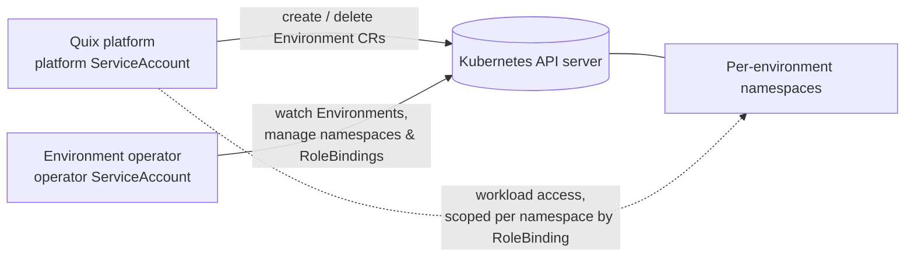
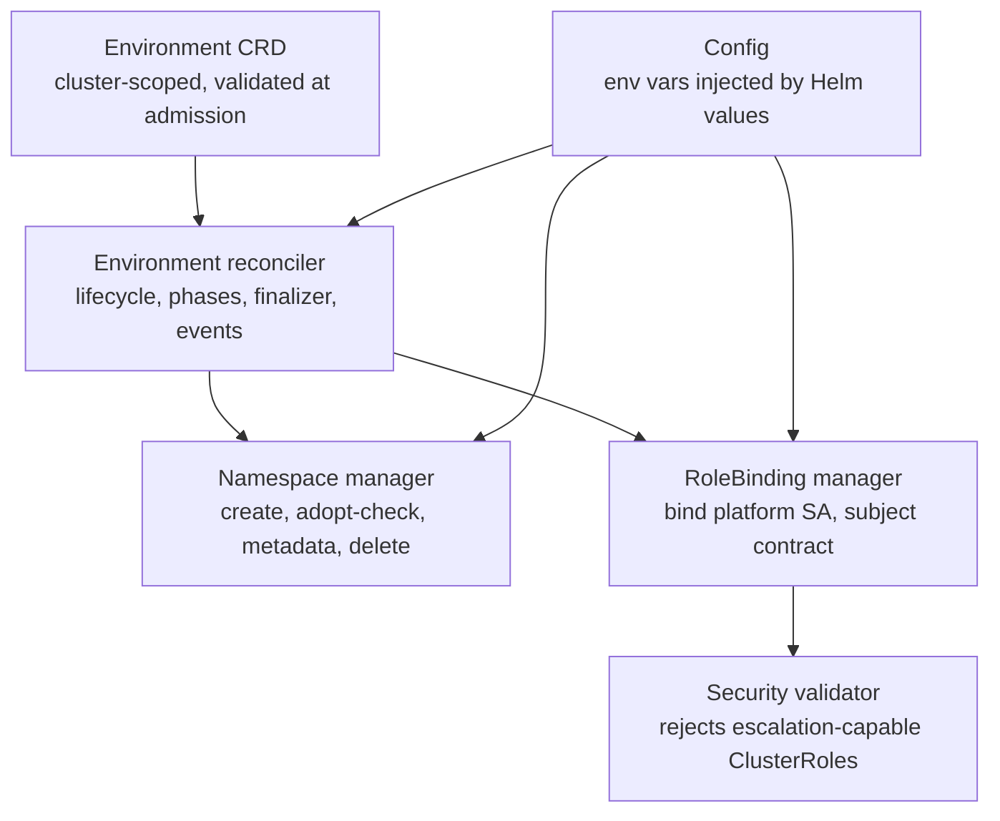

# Architecture

<!-- solution-docs:begin architecture -->
## Context

The operator sits between the Quix platform (the consumer that requests environments) and the customer's Kubernetes cluster. Its only external dependency is the Kubernetes API server. It ships as a Helm chart containing the CRD, the operator Deployment, and the RBAC manifests for **two** distinct identities.

## Two identities, two permission sets

- **Operator ServiceAccount** — the controller's own identity. Holds only operational permissions (manage `environments`, `namespaces`, `rolebindings`, read `clusterroles`) plus the `bind` verb on the platform ClusterRole. It does **not** hold the workload permissions it hands out — see [decisions.md](decisions.md).
- **Platform ServiceAccount** — the identity the Quix platform uses. Gains workload permissions namespace-by-namespace, only through the RoleBindings the operator creates. The single exception is cluster-wide access to `Environment` objects themselves, which are cluster-scoped and therefore cannot be granted per-namespace.

## Components

- **Environment CRD** (`api/v1/`) — the integration contract. Admission-time validation (ID pattern, immutability of name and ID, `quix.io/`-prefixed metadata with protected keys) rejects bad input before the controller ever runs.
- **Environment reconciler** (`internal/controller/environment/`) — orchestrates the lifecycle: validate, provision, track status, and tear down via finalizer. Emits Kubernetes events for significant actions.
- **Namespace manager** (`internal/resources/namespace/`) — owns namespace naming, ownership labels, metadata propagation, and refuses to adopt or delete namespaces whose identity labels don't match the environment.
- **RoleBinding manager** (`internal/resources/rolebinding/`) — creates and reconciles the per-namespace RoleBinding binding the platform ServiceAccount to the configured ClusterRole.
- **Security validator** (`internal/security/`) — inspects the configured ClusterRole for rules that would allow privilege escalation; runs fail-fast at startup and again on every RoleBinding reconcile.
- **Config** (`internal/config/`) — all tuning (namespace suffix, ID regex, ServiceAccount/ClusterRole names, cache sync period) arrives as environment variables set from Helm values, validated at startup.

## Control flow

Create: platform creates an `Environment` → reconciler adds a finalizer, validates the ID → namespace is created (or ownership-verified) → the validator checks the platform ClusterRole → RoleBinding is created → status becomes `Ready`. Delete: the finalizer drives RoleBinding and namespace deletion, waits for namespace termination, then releases the `Environment`. Out-of-band changes to managed resources (labels stripped, RoleBinding subjects edited) are reverted on the next reconcile; the informer cache resync bounds how stale that can get.

## Why this shape

It is a standard controller-runtime operator: one reconciler per CRD, level-triggered, idempotent. Resource-type logic lives in managers behind interfaces so the reconciler stays a thin orchestrator and each manager is independently testable against envtest. Security checks are centralized in one validator so the permission story can be audited in one place. The alternative — one privileged platform identity with cluster-wide workload access — is exactly what this design exists to avoid.

_Generated by solution-docs against commit `2d03724` on 2026-07-03._
<!-- solution-docs:end architecture -->
