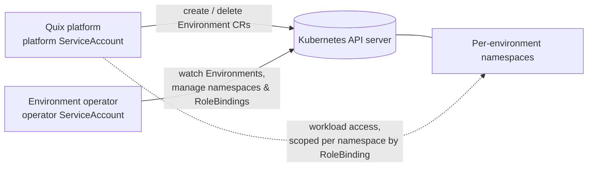
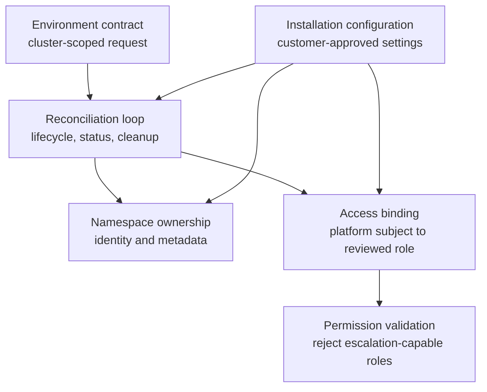

# Architecture

<!-- solution-docs:begin architecture -->
## Context

The operator sits between the Quix platform (the consumer that requests environments) and the customer's Kubernetes cluster. Its only external dependency is the Kubernetes API server. It ships as a Helm chart containing the CRD, the operator Deployment, and the RBAC manifests for **two** distinct identities.

## Two identities, two permission sets

- **Operator ServiceAccount** — the controller's own identity. Holds only operational permissions (manage `environments`, `namespaces`, `rolebindings`, read `clusterroles`) plus the `bind` verb on the platform ClusterRole. It does **not** hold the workload permissions it hands out — see [decisions.md](decisions.md).
- **Platform ServiceAccount** — the identity the Quix platform uses. Gains workload permissions namespace-by-namespace, only through the RoleBindings the operator creates. The single exception is cluster-wide access to `Environment` objects themselves, which are cluster-scoped and therefore cannot be granted per-namespace.

## Components

- **Environment contract** — the integration surface the platform uses to request an environment.
- **Reconciliation loop** — turns each request into the desired cluster state, reports progress, and drives cleanup when the request is deleted.
- **Namespace ownership** — defines the environment namespace identity and refuses to take over resources that do not match it.
- **Access binding** — grants the platform identity access to one environment namespace at a time.
- **Permission validation** — checks the customer-approved platform role before the operator binds it.
- **Installation configuration** — carries customer choices such as naming, platform identity, and endpoint exposure into the running operator.

## Control flow

Create: platform requests an environment → the operator records ownership intent → namespace identity is established → the platform role is validated → scoped access is bound → status reports readiness. Delete: the same ownership model drives access removal and namespace cleanup before the request is released. Out-of-band drift in managed resources is repaired by the next reconciliation pass when it falls within the operator’s ownership contract.

## Why this shape

The operator uses Kubernetes’ native reconciliation model because environment provisioning is declarative, retryable, and observable through the cluster API. Keeping namespace ownership, access binding, and permission validation as separate responsibilities makes the trust boundary reviewable without requiring the platform identity to hold cluster-wide workload permissions.

_Generated by solution-docs against commit `0559dec` on 2026-07-16._
<!-- solution-docs:end architecture -->
